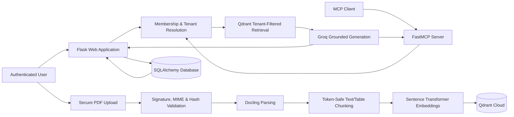

# Vaultify

<p align="center">
  <strong>Multi-Tenant RAG, MCP & Document Intelligence Platform</strong>
</p>

<p align="center">
  
  
  
  
  
</p>

Vaultify is a full-stack document intelligence platform for securely ingesting private documents, retrieving tenant-scoped evidence, and exposing grounded answers through both a web application and the Model Context Protocol (MCP).

The project combines authenticated organizations, secure PDF processing, Qdrant vector search, Groq-powered answer generation, structured source metadata, and server-resolved tenant isolation.

> **Project status:** working portfolio prototype under active stabilization. The RAG, MCP, authentication, multi-tenancy, document upload, and public tunnel flows have been validated. Persistent storage, background ingestion, and production deployment remain on the roadmap.

---

## Why Vaultify?

Most RAG demos assume one user and one shared document collection. Vaultify was designed around a stricter requirement:

> A user must only retrieve documents belonging to an organization they are authorized to access.

The tenant identifier is therefore resolved from the authenticated server-side membership. It is never accepted from a user-controlled question form or MCP tool argument.

---

## Verified capabilities

### Document ingestion

- Secure PDF signature and MIME validation
- SHA-256 document hashing and duplicate prevention
- Docling-based PDF parsing
- Text-aware and table-aware chunking
- Sentence Transformer embeddings with 384 dimensions
- Deterministic Qdrant point identifiers
- Batched vector uploads
- Tenant and document-hash payload indexes
- Upload, retry, status, and delete workflows

### Retrieval and grounded answers

- Mandatory tenant-filtered Qdrant retrieval
- Groq-powered evidence-only answer generation
- Source filenames, document sections, and similarity scores
- Tested refusal to expose Apple data from a separate Tesla organization
- Query logging through the web application

### Authentication and multi-tenancy

- Registration, login, and logout
- Secure password hashing
- CSRF protection
- Users, organizations, memberships, and owner roles
- Server-resolved active organization
- Organization-scoped documents and retrieval

### MCP integration

- `ask_documents` MCP tool
- FastMCP with stateless Streamable HTTP
- Structured JSON results
- Local in-memory and HTTP validation
- Public MCP validation through Cloudflare Quick Tunnels
- Server-bound tenant configuration for the current prototype

### Web application

- Responsive dark user interface
- Dashboard with organization and document statistics
- Document management page
- Organization page
- Secure PDF upload flow
- Public health checks through a separate Cloudflare tunnel

---

## Verified engineering metrics

| Metric | Result |
|---|---:|
| Validated seed chunks | **749** |
| Apple FY2025 chunks | **609** |
| Tesla Q4 2025 chunks | **140** |
| Embedding dimensions | **384** |
| Validated seed token ceiling | **240 tokens** |
| Cross-tenant document leakage in tested Apple/Tesla scenarios | **0** |
| Public MCP tools | **1** (`ask_documents`) |

Validated grounded-answer examples:

- Apple FY2025 total net sales: **$416,161 million**
- Tesla Q4 2025 total revenue: **$24,901 million**

---

## Architecture



### Query path

```text
Authenticated request
→ trusted organization membership
→ tenant-filtered vector search
→ grounded Groq answer
→ source metadata and similarity scores
```

### Ingestion path

```text
PDF upload
→ file validation
→ SHA-256 duplicate check
→ Docling parsing
→ token-safe chunking
→ normalized embeddings
→ tenant-scoped Qdrant upload
```

---

## Technology stack

| Area | Technologies |
|---|---|
| Language | Python 3.12 |
| Web backend | Flask, SQLAlchemy, Flask-Login, Flask-WTF |
| PDF processing | Docling, RapidOCR |
| Embeddings | Sentence Transformers, `all-MiniLM-L6-v2` |
| Vector database | Qdrant Cloud |
| LLM inference | Groq API, Llama 3.3 70B |
| Agent/tool access | Model Context Protocol, FastMCP |
| Public development access | Cloudflare Quick Tunnels |
| Development environment | Google Colab, T4 GPU |

---

## Repository branches

The repository separates the auditable development history from the modular rebuild.

| Branch | Purpose |
|---|---|
| [`main`](https://github.com/IhabAltekreeti/vaultify/tree/main) | Project overview and stable repository landing page |
| [`vaultify-colab-full`](https://github.com/IhabAltekreeti/vaultify/tree/vaultify-colab-full) | Full Colab development notebook and Python export |
| [`vaultify-v3-rebuild`](https://github.com/IhabAltekreeti/vaultify/tree/vaultify-v3-rebuild) | Ongoing modular Flask/MCP project rebuild |

The full development snapshot currently includes:

```text
vaultify_full.ipynb
vaultify_full.py
```

The compact launcher notebook is being stabilized before it becomes the recommended execution path.

---

## Development workflow

Clone the repository and switch to the full Colab branch:

```bash
git clone https://github.com/IhabAltekreeti/vaultify.git
cd vaultify
git checkout vaultify-colab-full
```

Open `vaultify_full.ipynb` in Google Colab and configure the required secrets through **Colab Secrets**:

```text
QDRANT_URL
QDRANT_API_KEY
GROQ_API_KEY
```

Optional application secret:

```text
FLASK_SECRET_KEY
```

> Do not commit API keys, `.env` files, SQLite databases, uploaded PDFs, or generated credentials.

---

## Quality engineering and current stabilization

A comparison between the validated seed pipeline and a newer web-upload pipeline found a hidden ingestion-quality issue:

| Tesla pipeline | Chunks | Exact duplicates | Chunks above 256 tokens | Maximum tokens |
|---|---:|---:|---:|---:|
| Validated seed pipeline | 140 | 4 | 0 | 240 |
| Web-upload audit | 293 | 4 | 84 | 778 |

The audit showed that long inputs could be silently truncated by the embedding tokenizer rather than rejected. The web ingestion pipeline is therefore being replaced with a hard-validated chunker that targets:

- A maximum of 240 tokens per chunk
- Exact duplicate removal before embedding
- Table-header preservation
- Safe splitting of oversized table rows
- A final hard validation before Qdrant writes

The audited 293-chunk strategy is **not considered final**.

---

## Security model

- Tenant identity is resolved from authenticated organization membership.
- Retrieval always includes a mandatory Qdrant tenant filter.
- MCP clients do not supply their own tenant identifier.
- Passwords are stored as secure hashes.
- State-changing web forms use CSRF protection.
- PDF content and signatures are validated before ingestion.
- Duplicate documents are detected through SHA-256 hashes.
- Secrets are loaded from environment variables or Colab Secrets.

Current development limitations:

- SQLite and uploaded files inside Colab are temporary.
- Cloudflare Quick Tunnel URLs change after runtime restarts.
- The current upload pipeline is synchronous.
- The prototype MCP server is bound to one trusted tenant at startup.
- This repository is not yet a production hosting package.

---

## Roadmap

### Phase 1 — RAG foundation

- [x] PDF parsing and OCR support
- [x] Text/table chunking
- [x] Qdrant indexing
- [x] Tenant-filtered retrieval
- [x] Grounded Groq answers
- [x] Structured source metadata

### Phase 2 — MCP and multi-tenancy

- [x] Streamable HTTP MCP tool
- [x] Registration and login
- [x] Organizations and memberships
- [x] Trusted tenant resolution
- [x] Cross-tenant isolation testing
- [ ] Per-organization MCP credentials
- [ ] MCP rate limiting and audit logs

### Phase 3 — Ingestion stabilization

- [x] Automated chunk audit
- [x] Oversized-chunk detection
- [x] Exact-duplicate detection
- [ ] Final 240-token hard-limit chunker
- [ ] Tesla and Apple dry-run regression tests
- [ ] Replace the audited web-upload vectors

### Phase 4 — Product experience

- [ ] Drag-and-drop document upload
- [ ] Background ingestion jobs
- [ ] Real processing progress and percentages
- [ ] Human-readable file sizes and local timestamps
- [ ] Improved source cards and no-answer behavior

### Phase 5 — Production infrastructure

- [ ] PostgreSQL database
- [ ] Persistent object storage
- [ ] Background queue and workers
- [ ] Named Cloudflare Tunnel and custom domain
- [ ] Continuous integration and automated tests
- [ ] Monitoring, backups, and production secrets management

---

## Author

**Ihab Altekreeti** — AI Engineer & Backend Developer

- GitHub: [@IhabAltekreeti](https://github.com/IhabAltekreeti)
- LinkedIn: [ihabaltekreetieng](https://www.linkedin.com/in/ihabaltekreetieng)

---

> Vaultify is under active development. The repository documents both validated behavior and discovered engineering limitations rather than presenting unverified production claims.
